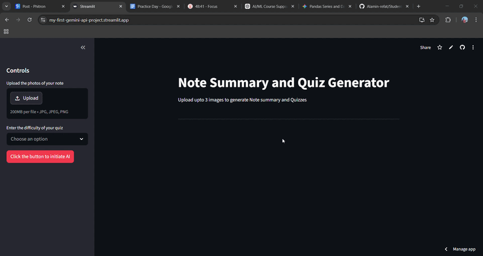
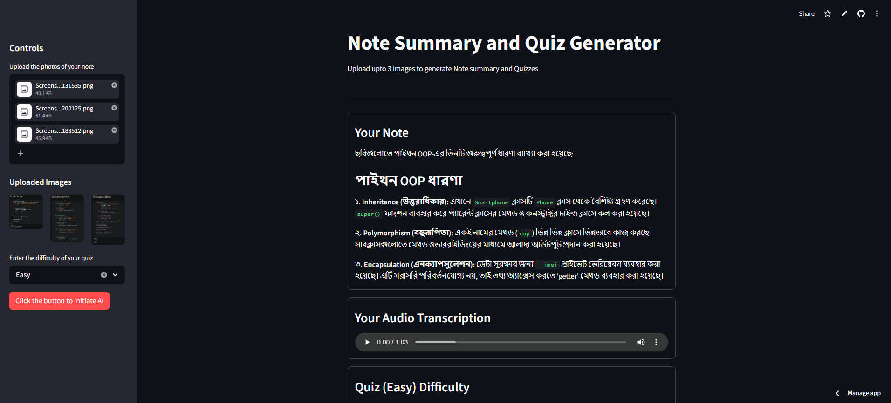

<p align="center">
  
</p>

[](https://my-first-gemini-api-project.streamlit.app/)

# 🚀 Note Summary & Quiz Generator (AI Powered)


An AI-powered web application built using **Streamlit** and **Gemini API** that can generate **summaries, quizzes, and audio transcriptions** from uploaded notes (images).

---

## 📌 Project Overview

This project allows users to upload images of their study notes and automatically:

- 📖 Generate structured **summaries**
- 🧠 Create **quizzes** based on difficulty level
- 🎧 Convert content into **audio transcription**

It is designed to help students learn faster and revise more effectively using AI.

---

## 🚀 Live Demo

- **Streamlit Cloud:** https://my-first-gemini-api-project.streamlit.app/

---

## ⚙️ Tech Stack

- **Python**
- **Streamlit**
- **Google Gemini API**
- **gTTS (Text-to-Speech)**
- **PIL (Image Processing)**

---

## ✨ Features

✔ Upload up to 3 note images  
✔ AI-generated clean and structured summaries  
✔ Automatic quiz generation (Easy / Medium / Hard)  
✔ Audio transcription of notes  
✔ Simple and interactive UI  

---

## 🖼️ Demo Preview

<p align="center">
  
</p>

---

## 🚀 How to Run Locally

### 1️⃣ Clone the repository

```bash
git clone https://github.com/Alamin-refat/Streamlit_Gemini_Project_1
cd your-repo-name
```
### 2️⃣ Create virtual environment

```bash
python -m venv venv
venv\Scripts\activate

```

### 3️⃣ Install dependencies

```bash
pip install -r requirements.txt

```

### 4️⃣ Run the app

```bash
streamlit run app.py

```
---

## 📂 Project Structure

```
📁 Streamlit_Gemini_Project_1-folder
│── app.py
│── api_calling.py
│── requirements.txt
│── demo.png
│── demo2.gif
│── LICENSE
│── README.md

```
---
## 🧠 What I Learned

- Working with APIs (Gemini AI)  
- Building interactive apps using Streamlit  
- Handling image input & processing  
- Implementing AI-based automation  
- Managing environment variables securely  

---

## 🎯 Future Improvements

- Add support for PDF notes  
- Improve quiz difficulty logic  
- Add user authentication  

---

## 📜 License

This project is licensed under the **MIT License**.

### What does this mean?
- **Personal & Commercial Use:** You can use this project for your own portfolio or business.
- **Modification:** You are free to modify the code and add new features.
- **Distribution:** You can share this project with anyone.

*For more details, please check the [LICENSE](LICENSE) file in this repository.*

---

## 📬 Contact & Connect

If you have any questions, feedback, or would like to discuss potential collaborations, feel free to reach out!

**Alamin Refat** *Aspiring Data Scientist & Machine Learning Enthusiast*

[](https://www.linkedin.com/in/alaminrefat/)
[](https://github.com/Alamin-refat)
[](mailto:alaminrefat2017@gmail.com)

---
> **"Learning, building, and growing every day in the world of data and AI."**

